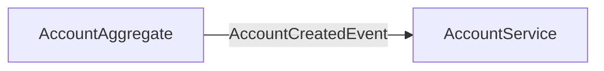

import Footer from '@catalog/components/footer.astro';

## Overview

The Account Service provides read-only access to user account information. It maintains a query model derived from account events and exposes a REST API for retrieving account details.

<Tiles>
    <Tile icon="UserGroupIcon" href="/docs/teams/framework-developers" title="Contact the team" description="Questions? Contact the service owners" />
    <Tile icon="BoltIcon" href={`/visualiser/services/${frontmatter.id}/${frontmatter.version}`} title={`Receives ${frontmatter.receives.length} messages`} description="This service consumes events to build its query model" />
</Tiles>

## Architecture diagram

<NodeGraph />

## Key Features

- **Account Information Retrieval**: Provides read access to user account details
- **Event-Driven Query Model**: Maintains an eventually consistent view of account data
- **RESTful API**: Offers a simple HTTP interface for retrieving account information

## API Documentation

The Account Service provides a RESTful API documented using the OpenAPI specification:

<OpenAPI />

## Integration Patterns

### Consuming Events

The Account Service consumes account-related events to build and maintain its query model:

<Footer />